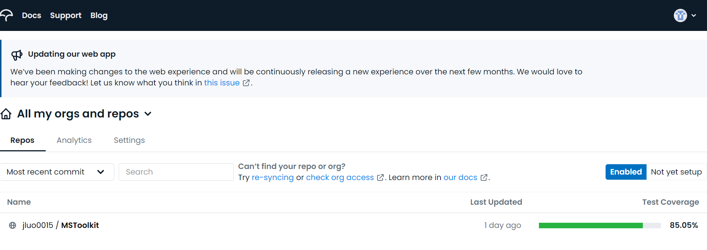

<style>
body{
text-align: justify
}
</style>


```{r setup, include=FALSE}
knitr::opts_chunk$set(echo = FALSE)
```

# Abstract

This internship aims to develop an existing R package called [MSToolkit](https://github.com/MikeKSmith/MSToolkit) by updating the documentation of functions with *roxygen* format, as well as creating the vignette and a new Github website. In addition, converting the existing unit tests cases to *testthat* format and increasing the code coverage of tests. During the process of developing the *MSToolkit* package, a few R packages would be applied, including *usethis*, *devtools*, *roxygen2*, *pkgdown*, and *testthat*. This report is used to review my jobs on the *MSToolkit* package. During the internship, I found my drawbacks and improved my ability to solve complicated problems in the process of creating or modifying R packages.  

# Background and motivation

The *MSToolkit* is an R package designed to help users simulate the clinical trials, evaluate the design of the trials and the analysis methodology, and quantify operating characteristics by the application of dose and the decision criteria of study level. The *MSToolkit* was written around 12 years ago and it was required to be updated by the more modern package development tools, like *usethis*, *testthat*, *pkgdown*. Besides, the author plans to develop the latest version of *MSToolkit* on Github. Therefore, I helped my supervisor modernise the *MSToolkit* package included tidy up the package, like converting the format of documentation and unit tests, as well as creating the vignette and the website. 

In my opinion, this internship provides me with an opportunity to apply my knowledge to a real and challenging job. It could help me practice my knowledge, discover my shortcomings and improve my ability to solve complex R-package problems. Furthermore, *MSToolkit* is a practical R package for simulation and evaluation of clinical trials, because it was designed for internal usage in Pfizer originally. Therefore, I also hope to help my supervisor to update this package and provide it to more users. Overall, those are my motivations that joining the internship and working on improving the *MSToolkit* package. 

# The development of the *MSToolkit* package

Currently, the *MSToolkit* is being developed to version 3.3.0. During the internship, I mainly worked on documenting the functions by *roxygen* format (or converting the original format to the *roxygen* format), converting the original unit test cases format to the *testthat* format and increasing the unit tests, as well as generating the vignette and the package website. Meanwhile, running the R-CMD-check, debugging and pushing the modification to Github for reproducibility is also main and regular during the development process of *MSToolkit*. Besides, the R-CMD-check, pkgdown and test-coverage have also been pushed to Github Actions to build the package. Overall, there are 208 commits were pushed and 349 files were changed during the update of this package. 

My [repository](https://github.com/jluo0015/MSToolkit) of the *MSToolkit* package was forked from the repository of my supervisor. All the development happens on the [Dev branch](https://github.com/jluo0015/MSToolkit/tree/Dev). When the development is finished, pull requests will be created and merge the modification into the Dev branch of my supervisor. 

## Unit test format transformation

In the older version, the *MSToolkit* package used the package called [RUnit](https://cran.r-project.org/web/packages/RUnit/index.html) to execute the unit testing. During the process of updating, the *testthat* package was applied to convert the format of the original unit tests. The differences between *RUnit* and *testthat* are shown below:

|RUnit|converted to|testthat|
|:-----:|:----------:|:--------:|
|checkException| ->|expect_error|
|checkTrue| ->|expect_true <br /> expect_false|
|checkEqual|->|expect_equal|

Besides, I also tried to generate new unit tests for the functions that have not been tested yet to increase the code coverage of tests. The test coverage was calculated by the [*covr*](https://github.com/r-lib/covr) package, and the coverage percentage is shown in Figure \@ref(fig:test-percentage): 

```{r test-percentage, fig.cap="Test Coverage Percentage", fig.align='center'}
knitr::include_graphics(here::here("pic/test_coverage_percentage.jpg"))
# 
```

## Vignette of *MSToolkit* package

There is no vignette of *MSToolkit* in the older version. However, the author generated a [package website](http://mikeksmith.github.io/MSToolkit/) in the older version. Therefore, I created the [vignette](https://jluo0015.github.io/MSToolkit/articles/MSToolkit_intro_vig.html) by summarising and modifying the articles on the older website. The vignette is designed to help users understand how to use the package, as well as the main features of the package. Therefore, there are four sections and four subsections in the vignette that contain the explanation of the two most important functions in the *MSToolkit* package. A part of the vignette is shown in Figure \@ref(fig:vignette):

```{r vignette, fig.cap="Vignette", fig.align='center'}
knitr::include_graphics(here::here("pic/vignette.png"))
```

Except for one section simply introduces the package and one explains how to troubleshoot the code, the rest two sections have made up most of the whole vignette, which is used to explain the *generateData* function and *analyzeData* function. In the section illustrating the *generateData* function, there are nine examples shown to explain how to use this function to generate the suitable simulation data based on different applications of dose and other control variables. The Figure \@ref(fig:generate-data-example) below shows the application of the basic linear model into the *generateData* function:

```{r generate-data-example, fig.cap="The Example of generateData Function", fig.align='center'}
knitr::include_graphics(here::here("pic/generateData.jpg"))
```

Meanwhile, in the section introducing the *analyzeData* function, a complete process including the trial design, data generation and data analysis has been created to guide users to apply this function. Besides, this section also explains three important arguments to help users better use the *analyzeData* function to get the appropriate result. The application of the *analyzeData* function is shown in Figure \@ref(fig:analyze-data-example):

```{r analyze-data-example, fig.cap="The Example of analyzeData Function", fig.align='center'}
knitr::include_graphics(here::here("pic/analyzeData.jpg"))
```

## The Github website of the *MSToolkit* package

Although a package website already existed. Based on the requirement of developing the *MSToolkit* package, a new Github website is needed to be recreated by the *pkgdown* package. Therefore, I generated the new [Github website](https://jluo0015.github.io/MSToolkit/) based on the contents from the old one but with some modifications. 

The website contains five parts. The first one is the [home page](https://jluo0015.github.io/MSToolkit/) which is used to display the basic information of *MSToolkit*, like the installation, usage and how to run the analysis under an external environment. A part of the home page is shown in Figure \@ref(fig:home-page): 

```{r home-page, fig.cap="Home Page", fig.align='center'}
knitr::include_graphics(here::here("pic/home_page.jpg"))
```

The second part is [Get Started](https://jluo0015.github.io/MSToolkit/articles/MSToolkit_intro_vig.html) which contains the vignette of *MSToolkit* and explains to users how to use the main functions of the package. A part of the Get started is shown in Figure \@ref(fig:get-started): 

```{r get-started, fig.cap="Get Started", fig.align='center'}
knitr::include_graphics(here::here("pic/get_started.jpg"))
```

The third part is the [Reference](https://jluo0015.github.io/MSToolkit/reference/index.html) which is used to display all the functions of the *MSToolkit* package. A part of the Reference is shown in Figure \@ref(fig:reference): 

```{r reference, fig.cap="Reference", fig.align='center'}
knitr::include_graphics(here::here("pic/reference.png"))
```

The fourth part is the Articles. In the Articles part, there are two subsections. The first subsection contains two articles which are [generateData](https://jluo0015.github.io/MSToolkit/articles/generate_data.html) and [analyzeData](https://jluo0015.github.io/MSToolkit/articles/analyze_data.html). They all provide further detail about these two important functions. Another subsection is background reading, which contains two articles. The [Simulation Overview](https://jluo0015.github.io/MSToolkit/articles/simulation_overview.html) explains the clinical trial simulation which is the core concept of simulation in the *MSToolkit* package. Another one is [References](https://jluo0015.github.io/MSToolkit/articles/references.html) which contains the references list for creating this package. 

The last part is the [Changelog](https://jluo0015.github.io/MSToolkit/news/index.html). It shows the development status of the *MSToolkit* package from version 1.0.0 to version 3.0.0. A part of the Changelog is shown in Figure \@ref(fig:change-log):

```{r change-log, fig.cap="Changelog", fig.align='center'}
knitr::include_graphics(here::here("pic/changelog.jpg"))
```

# Conclusion

In conclusion, updating a package is a complicated job, especially when we need to modernise the package and convert the original format. However, this is also a good opportunity for us to apply our learning and practice our knowledge, as well as learn some new knowledge. Besides, we also need to be patient in the process of debugging because it is always difficult. 

Because my supervisor does not accept my pull requests yet, all my jobs are still in the Dev branch of my repository. Besides, I have discussed with my supervisor. He agreed that I can keep working on this project even though I finish the internship. Therefore, I will keep working on improving this package after that and hope to republish it on CRAN again. Overall, this is a good opportunity for me and I think it could help my future career.  

# References

Yihui Xie (2021). knitr: A General-Purpose Package for Dynamic Report Generation in R. R package version 1.37.

Yihui Xie (2015) Dynamic Documents with R and knitr. 2nd edition. Chapman and Hall/CRC. ISBN 978-1498716963

Yihui Xie (2014) knitr: A Comprehensive Tool for Reproducible Research in R. In Victoria Stodden, Friedrich Leisch and Roger D. Peng, editors, Implementing
  Reproducible Computational Research. Chapman and Hall/CRC. ISBN 978-1466561595

Kirill Müller (2020). here: A Simpler Way to Find Your Files. R package version 1.0.1. https://CRAN.R-project.org/package=here